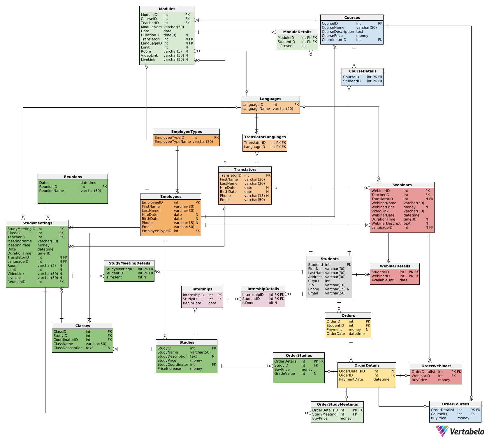

---
# Project - Course Provider

**Authors:** Dariusz Rozmus, Jan Sarba

---

# System Requirements and Functions

## System Description

The database system aims to streamline operations for a company offering various courses and training programs. It will store information about trainees, instructors, meeting schedules, and payments. The system also enables each user to view the status of processes relevant to them.

## System Users

- Trainee/Client (T)
- Instructor (I)
- Owner (O)
- Administration Department (A) - The director is part of the administration
- Database Creator and Administrator (D)

## System Functions

- Event registration and availability checking (T)
- Generating summaries and reports (A,D)
- Checking scheduled events (T,A,I,O)
- Checking for scheduling conflicts (A,T,I)
- Attendance list viewing (A,I,T,D,O)
- Attendance recording (I)
- Entering events, syllabi, etc. (A,D)
- List of paid and outstanding payments (T)
- List of payments and debtors (A,D,O)
- Exceptional situations, fee waivers for trainees, etc. (O)

# Database Schema

---

# Views, procedures, triggers

## Views

Our database comes equipped with strategically designed views that transform raw data into actionable business insights:

- **Financial Tracking**: Specialized views like `Raport_finansowy` and debtors reports provide real-time revenue analysis
- **Attendance Analytics**: Views calculate attendance percentages for both courses and study programs
- **Event Management**: Upcoming events views with filtering by type (courses, webinars, study meetings)
- **Registration Overview**: Views showing enrolled participants for all program types
- **Hybrid Learning Support**: Views distinguish between online and in-person events with relevant links/rooms

## Procedures

We've implemented robust procedures that ensure data integrity while simplifying complex operations:

- **User Management**: Streamlined procedures for adding students, employees, and translators
- **Academic Operations**: Procedures for adding studies, classes, and courses with validation
- **Order Processing**: A complete order workflow with:
  - Main order creation
  - Specialized procedures for each product type (courses, webinars, studies)
  - Transaction-safe operations with proper error handling
- **Payment Integration**: Procedures that handle financial transactions while maintaining audit trails

## Triggers

Our database includes intelligent triggers that:

- **Maintain Audit Trails**: The `trg_LogCourseOrder` trigger automatically logs all course orders for historical tracking
- **Ensure Data Quality**: Table constraints included in `create-table.sql` work with triggers to enforce business rules
- **Support Reporting**: Triggers help keep analytical views up-to-date with minimal overhead

## Implementation Value

This implementation delivers:

- **Real-time business visibility** through comprehensive views  
- **Operational efficiency** via parameterized procedures  
- **Data integrity** with constraints and triggers  
- **Scalable architecture** that supports future growth  
- **User-friendly interfaces** abstracting complex database operations  

The complete SQL code for all database objects is available in the implementation documentation.
